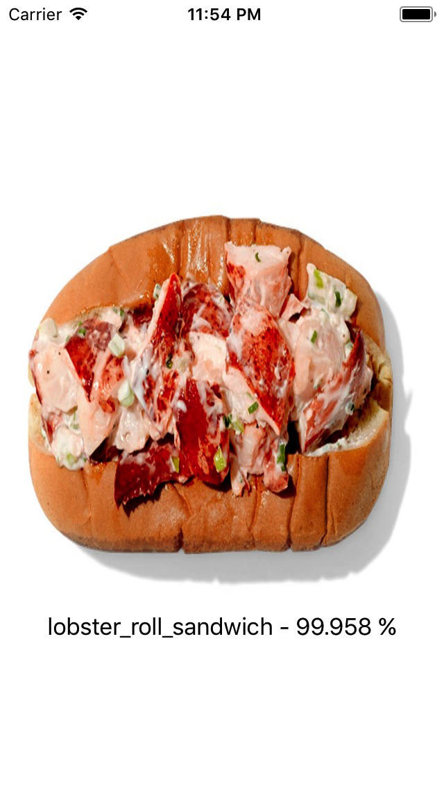
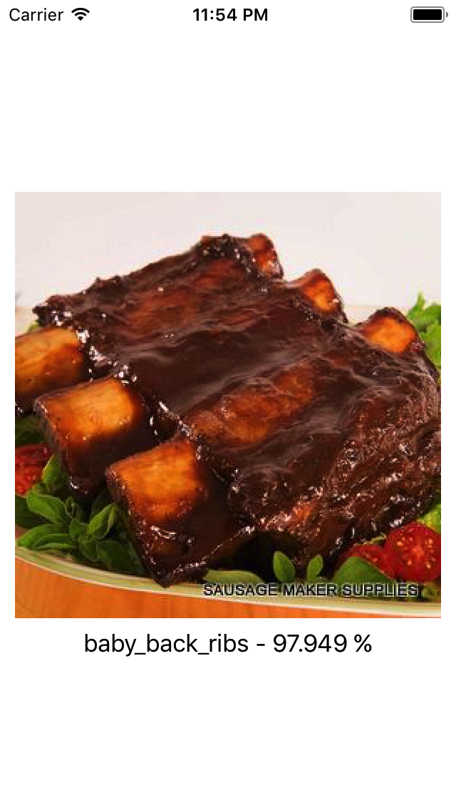
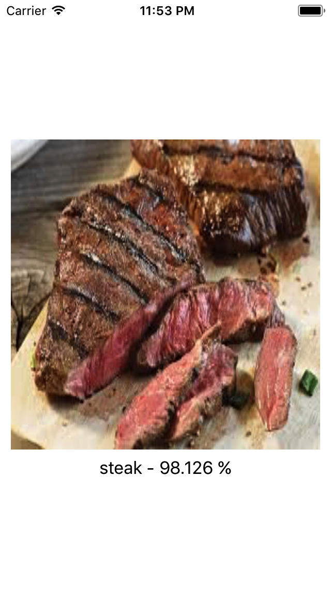
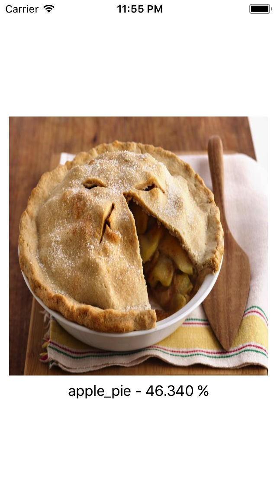

# Food101 for CoreML

### Description
This is the Food101 dataset implemented in Apple's new framework CoreML. The Food101 dataset can predict foods from images. The model was built with Keras 1.2.2 and is a **fine-tuned InceptionV3 model**.

To test this model you can open the `MNISTPrediction.xcodeproj` and run it on your device (iOS 11 and Xcode 9 is required). To test further images just add them to the project and replace my testing with yours.

I included the necessary preprocessing as an extension in my `ViewController.swift`. The model was trained to take 299x299 RGB images so keep an eye out for the right aspect ratio.

For further information about this dataset and how it was trained see my `food101.py` in the `Convert` directory or visit [Food101 Keras](https://github.com/stratospark/food-101-keras)

### Examples

