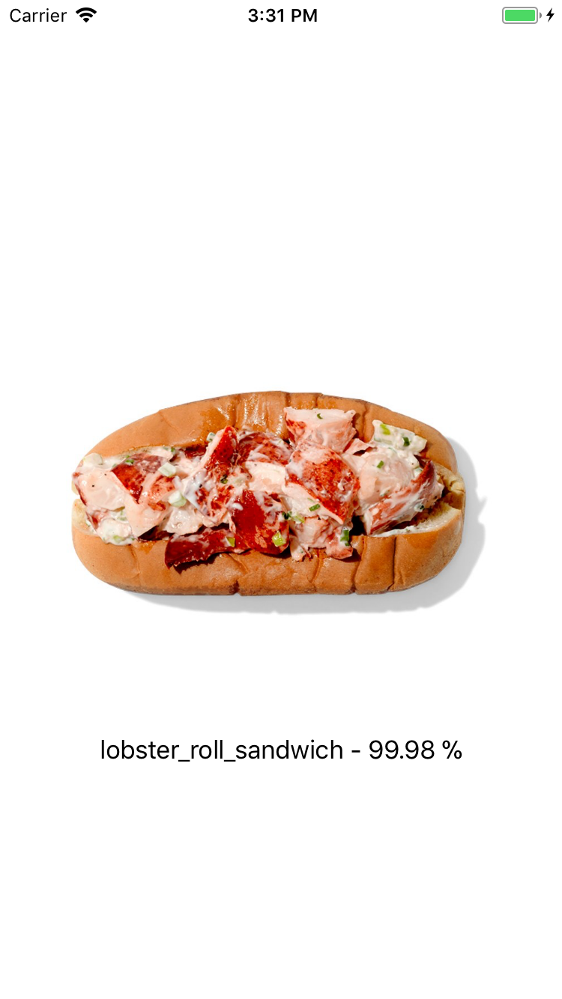
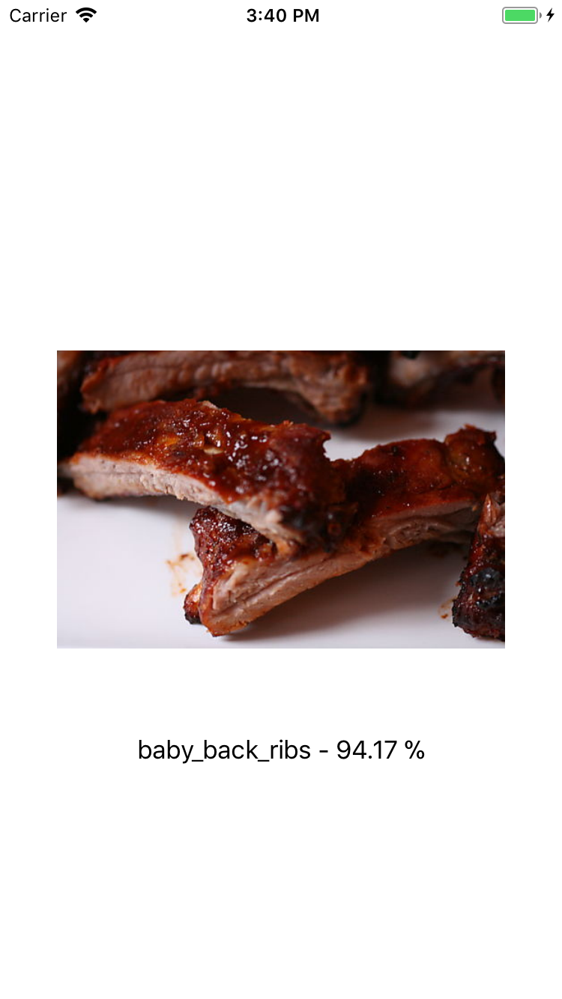

# Food101 for CoreML

### Description
This is the Food101 dataset implemented in Apple's new framework CoreML. The Food101 dataset can predict foods from images. The model was built with Keras 1.2.2 and is a **fine-tuned InceptionV3 model**.

To test this model you can open the `Food101Prediction.xcodeproj` and run it on your device (iOS 11 and Xcode 9 is required). To test further images just add them to the project and replace my testing with yours.

### Obtaining the model
*  [Download](https://drive.google.com/open?id=0B5TjkH3njRqnVjBPZGRZbkNITjA) the model from Google Drive and drag it right into your project folder
* Convert the model on your own:
  1. Change directory:  `cd ./Convert`
  2. Change directory:  `sh convert.sh`
  
### More information
  If you want to find out more how this model works and on which data it was trained on, feel free to visit the original Food101 Keras page on [Github](https://github.com/stratospark/food-101-keras)
  
### Examples

